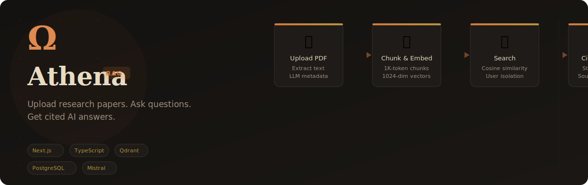
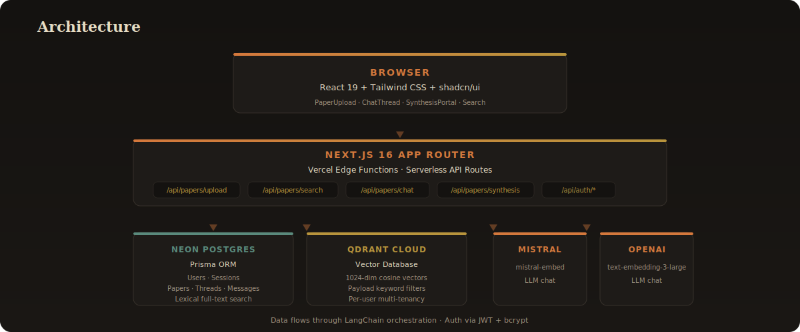

<p align="center">
  
</p>


## What It Is

Athena transforms research PDFs into a conversational knowledge base. Upload a paper, ask questions in natural language, and get answers with real source citations — powered by production-grade RAG with vector search and LLM orchestration.

<p align="center">
  <a href="https://athena-rag-theta.vercel.app" target="_blank">
    
  </a>
</p>

<br>

## Key Capabilities

| | |
|---|---|
| **Paper Ingestion** | Upload PDFs → LLM metadata extraction (title, authors, year, abstract) → chunking (1K tokens, 200 overlap) → vector embedding |
| **Dual-Mode Search** | Semantic (cosine-similarity vector retrieval) + Lexical (Postgres full-text across title/author/abstract) |
| **Persistent AI Chat** | Streaming responses via Vercel AI SDK, thread history in PostgreSQL, sources cited inline |
| **Cross-Paper Synthesis** | Retrieve top chunks from multiple papers simultaneously for literature reviews and gap analysis |
| **Multi-Tenant Auth** | JWT sessions (HttpOnly, Secure), bcrypt hashing, per-user data isolation at the query level |

<br>

## How It Works

Upload a PDF. Athena extracts the text, runs an LLM pass to infer metadata, splits the content into overlapping chunks, and embeds each chunk as a 1024-dimension vector stored in Qdrant Cloud. When you ask a question, the system retrieves the most relevant chunks via cosine similarity, filters them to your user scope, and streams a cited answer from Mistral or OpenAI.

<p align="center">
  
</p>

<br>

## Getting Started

```bash
git clone https://github.com/Yousuf-Wizdan/Athena---Research-RAG.git
cd Athena---Research-RAG
pnpm install
cp .env.example .env.local
npx prisma migrate deploy
pnpm dev
```

Requires Node.js 20+, pnpm 9+, a [Qdrant Cloud](https://cloud.qdrant.io) cluster, [Neon](https://neon.tech) PostgreSQL, and a Mistral or OpenAI API key.

<br>

## Tech Stack

| Layer | Technology |
|---|---|
| **Framework** | Next.js 16 (App Router + Turbopack) |
| **UI** | React 19 + Tailwind CSS v4 + shadcn/ui New York |
| **ORM** | Prisma 6 + Neon PostgreSQL |
| **Vector DB** | Qdrant Cloud (1024-dim cosine, payload keyword filters) |
| **Embeddings** | Mistral `mistral-embed` / OpenAI `text-embedding-3-large` |
| **LLM** | Mistral / OpenAI via AI SDK + LangChain |
| **Auth** | JWT + bcrypt (custom, no NextAuth) |
| **PDF Parsing** | pdf-parse |
| **Deployment** | Vercel (Production + Preview) |

<br>

## Performance

| Operation | P50 Latency |
|---|---|
| PDF ingestion (10-page paper) | ~4–8s |
| Semantic search (top-15 chunks) | ~200–400ms |
| First chat token (streaming) | ~600–1,200ms |
| Cross-paper synthesis | ~2–5s |

<br>

## Roadmap

- **Hybrid search** — BM25 + vector scores via Reciprocal Rank Fusion
- **Citation graph** — extract and visualise paper reference networks
- **Multi-modal** — support figures and tables via vision models
- **Export** — synthesis results as structured markdown / LaTeX
- **Collaboration** — shared paper libraries and annotation layers

<br>

---

<div align="center">
  <br>
  <p><strong>Yousuf Wizdan</strong> — Full-Stack Engineer · AI/ML Systems</p>
  <p>
    <a href="https://github.com/Yousuf-Wizdan">
      
    </a>
    &nbsp;
    <a href="https://athena-rag-theta.vercel.app">
      
    </a>
  </p>
  <br>
  <p><em>Built from first principles. Deployed to production. Ready for scale.</em></p>
</div>

<br>

<details>
<summary><b>Technical Deep-Dives</b></summary>

### Chunking Strategy

Papers are split using LangChain's `RecursiveCharacterTextSplitter` with **chunk size 1,000 tokens** and **overlap 200 tokens**. Metadata (`paperId`, `userId`, `title`, `source`, `chunkIndex`) is stored as Qdrant payload for multi-tenant filtering.

### Multi-Tenant Vector Isolation

Every search filters by the authenticated user's ID via Qdrant `must` filters with `metadata.userId`. Payload keyword indexes are created idempotently by treating HTTP 409 as success.

```typescript
const mustFilters = [
  { key: "metadata.userId", match: { value: user.id } }
];
const results = await vectorStore.similaritySearchWithScore(query, 15, { must: mustFilters });
```

### LLM Metadata Extraction

The first 3,000 characters of each PDF are sent to an LLM with a structured JSON prompt to extract `title`, `authors`, `publishedYear`, and `abstract`. Fallback logic handles malformed JSON gracefully.

### Streaming Architecture

Chat responses stream token-by-token using the **Vercel AI SDK** streaming protocol. Server emits a `ReadableStream`, client reads with the `useChat()` hook — no polling, no full-response buffering. Sources (paper titles + snippets) are attached to each message and persisted to Postgres.

</details>
